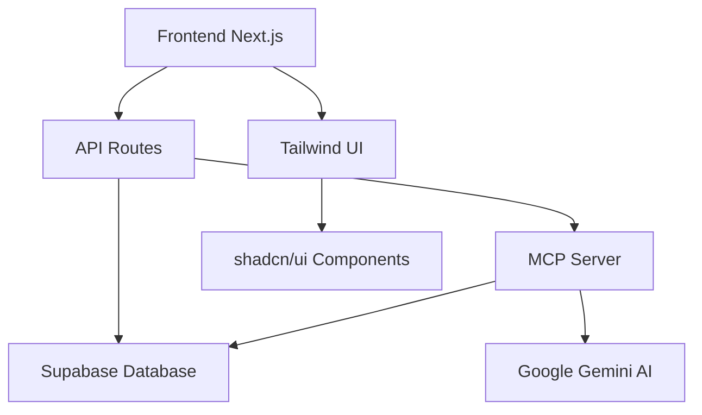

# Banorte Open Innovation - Proa by Banorte

**Plataforma Financiera Inteligente con IA para Análisis Personal y Empresarial**


##  Descripción del Proyecto

**Proa** es una plataforma financiera integral desarrollada para el HackMty 2025 de Banorte que combina análisis financiero tradicional con inteligencia artificial avanzada. Permite a usuarios personales y empresas gestionar sus finanzas, obtener insights inteligentes y tomar decisiones informadas a través de un asistente AI conversacional.

###  Características Principales

- **Dashboard Interactivo**: Visualización en tiempo real de métricas financieras
- **Chat AI Inteligente**: Asistente financiero potenciado por Google Gemini y MCP
- **Dual Mode**: Soporte para usuarios personales y empresariales
- **Análisis Avanzado**: KPIs, tendencias y recomendaciones automáticas
- **Tiempo Real**: Actualizaciones automáticas con Supabase
- **Responsive**: Diseño optimizado para móviles y escritorio


### Instalación

1. **Clonar el repositorio**
```bash
git clone https://github.com/ManuelPerezF/banorte-open-innovation.git
cd banorte-open-innovation
```

2. **Instalar dependencias**
```bash
npm install
```

3. **Configurar variables de entorno**
```bash
# Crear archivo .env.local
cp .env.example .env.local

# Editar .env.local con tus credenciales:
NEXT_PUBLIC_SUPABASE_URL=tu_supabase_url
NEXT_PUBLIC_SUPABASE_ANON_KEY=tu_supabase_anon_key
GOOGLE_GENERATIVE_AI_API_KEY=tu_gemini_api_key
```

4. **Configurar MCP Server**
```bash
cd mcp-server
npm install
cd ..
```

5. **Iniciar servicios de desarrollo**
```bash
npm run dev          # Frontend en puerto 3000
cd mcp-server && npm run dev  # MCP Server en puerto 3001
```

6. **Abrir la aplicación**
   - Frontend: [http://localhost:3000](http://localhost:3000)
   - MCP Server: [http://localhost:3001](http://localhost:3001)

## Arquitectura del Sistema



### Componentes Principales

- **Frontend**: Next.js 14 con App Router y TypeScript
- **Base de Datos**: Supabase PostgreSQL con vistas y funciones
- **AI Engine**: Google Gemini 2.5 Flash
- **MCP Protocol**: Enriquecimiento de contexto para AI
- **UI Framework**: Tailwind CSS + shadcn/ui

## Estructura del Proyecto

```
banorte-open-innovation/
├── app/                     # Páginas Next.js App Router
│   ├── api/                # API Routes
│   ├── dashboard/          # Dashboard principal
│   ├── chatbot/           # Interfaz de chat AI
│   ├── login/             # Autenticación
│   └── reporte/           # Reportes avanzados
├── components/             # Componentes React
│   ├── ui/                # Componentes base (shadcn/ui)
│   └── landing/           # Componentes del landing
├── services/              # Lógica de negocio
│   ├── supabase.ts        # Cliente de Supabase
│   ├── auth.ts            # Autenticación
│   └── chatContext.ts     # Contexto para AI
├── mcp-server/            # Servidor MCP independiente
│   └── src/
│       ├── index.ts       # Servidor principal
│       └── financial-tools.ts  # Herramientas financieras
└── lib/                   # Utilidades y helpers
```

## Credenciales de Demo

### Usuario Personal
- **ID**: `47`
- **Nombre**: `Usuario Demo`

### Usuario Empresarial
- **ID**: `E016`
- **Nombre**: `E016 SA de CV`

## Tecnologías Utilizadas

### Frontend
- **Next.js 14**: Framework React con App Router
- **TypeScript**: Tipado estático
- **Tailwind CSS**: Styling utility-first
- **shadcn/ui**: Componentes accesibles
- **Recharts**: Gráficos interactivos

### Backend
- **Supabase**: Base de datos PostgreSQL
- **Google Gemini AI**: Modelo de lenguaje
- **MCP Protocol**: Enriquecimiento de contexto
- **Node.js**: Runtime para MCP Server


## Esquema de Base de Datos

### Tablas Principales
- `app_users`: Usuarios personales
- `companies`: Empresas registradas
- `personal_tx`: Transacciones personales
- `company_tx`: Transacciones empresariales

### Vistas SQL
- `v_company_kpis`: KPIs calculados por empresa
- `v_company_monthly`: Métricas mensuales agregadas

### Funciones Stored
- `kpi_company_fn()`: Cálculo automático de KPIs
- `decisions_company_fn()`: Generación de recomendaciones
- `whatif_company_fn()`: Análisis de escenarios

